# Board.py Flowcharts

## `Board.__init__`

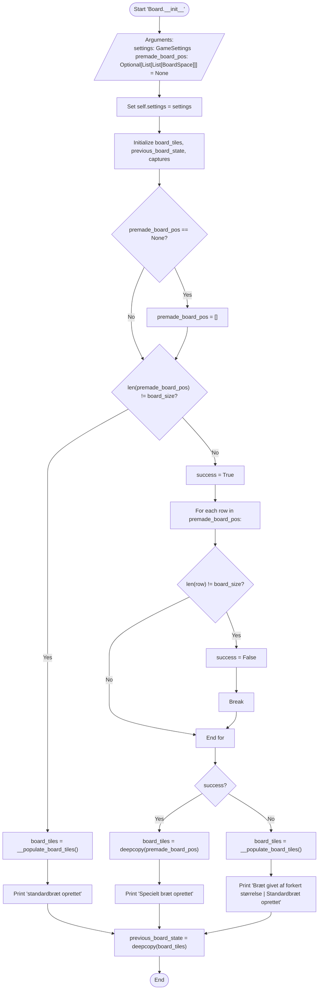

## `__populate_board_tiles`

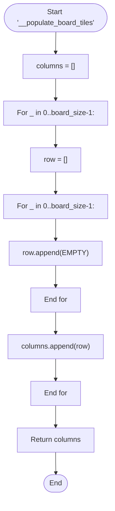

## `__out_of_bounds`

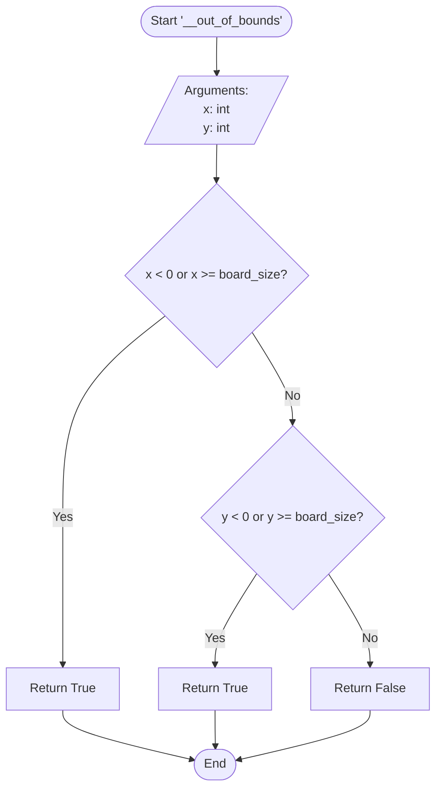

## `__get_adjacent_positions`

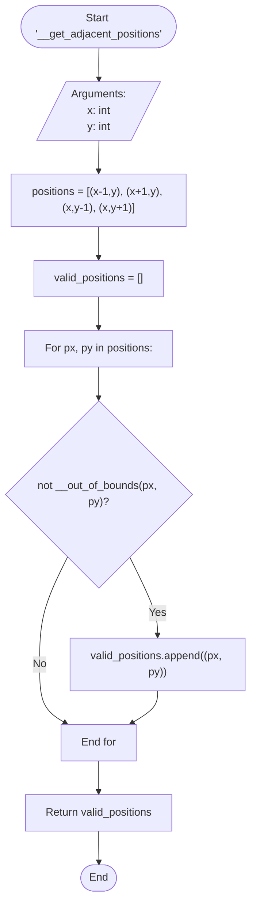

## `__get_group`

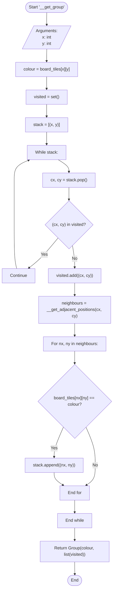

## `__group_has_liberties`

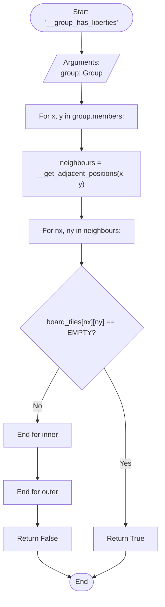

## `__remove_group`

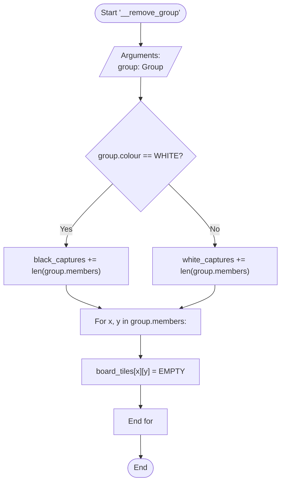

## `__board_equals`

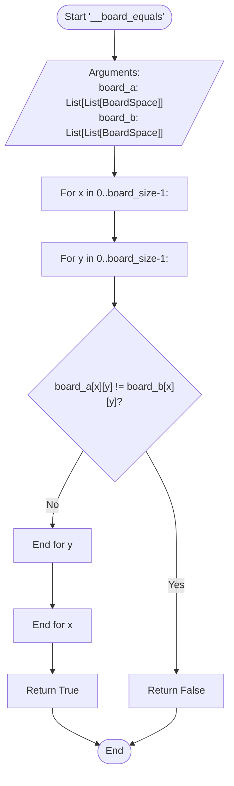

## `__get_opposite_colour`

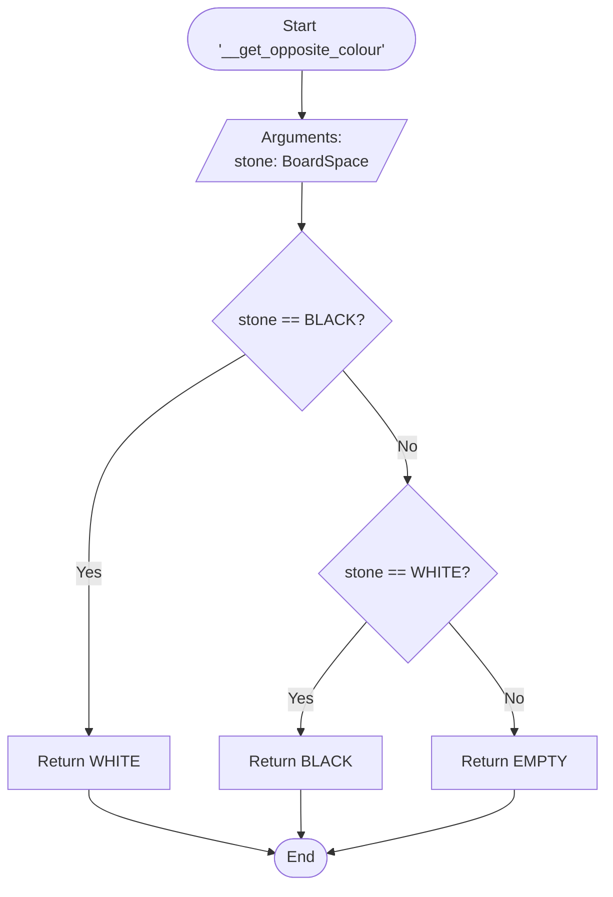

## `place_stone`

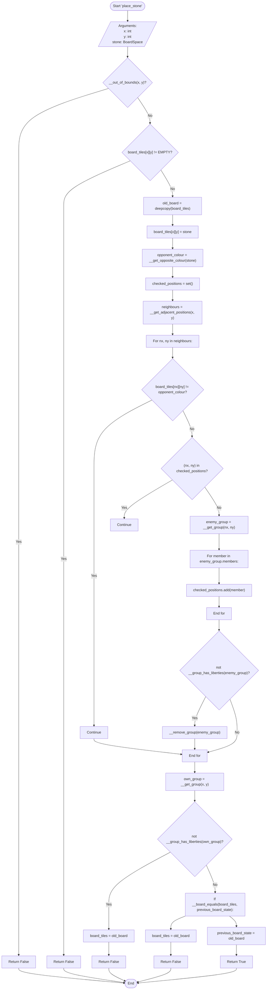

## `remove_stone`

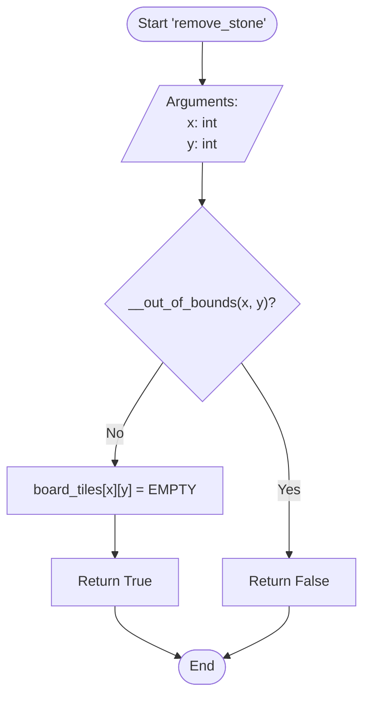

## `print_board`

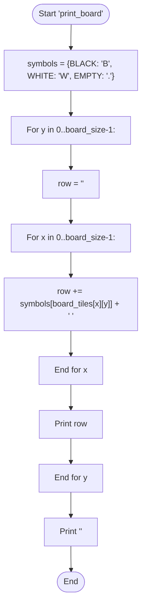

## `calculate_score`

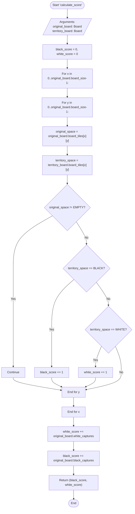
