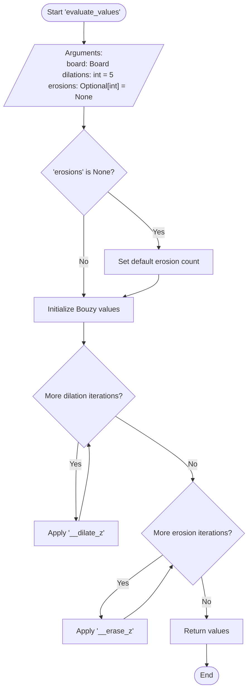
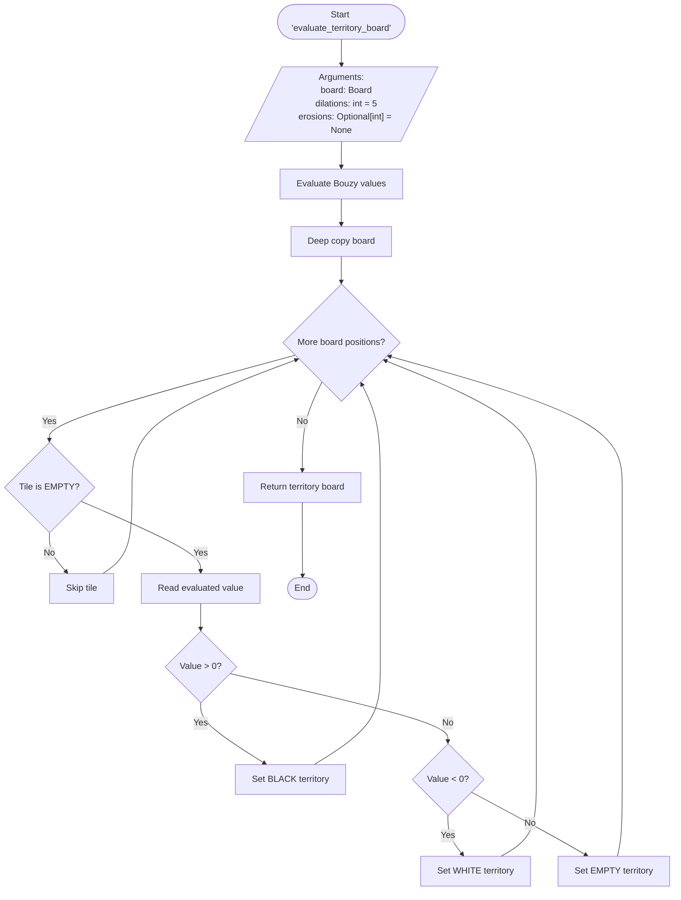
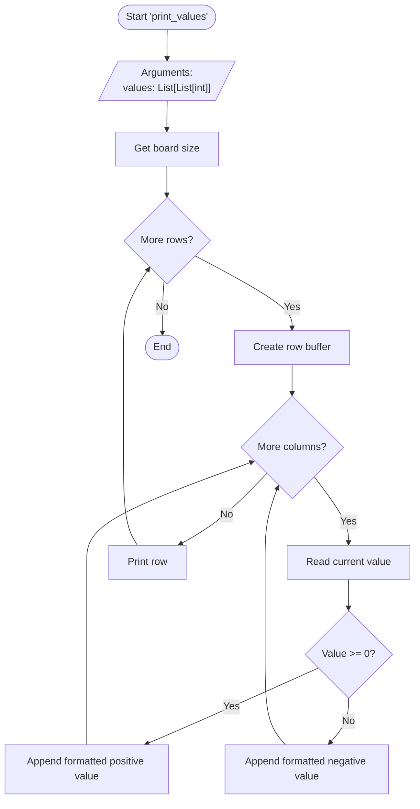
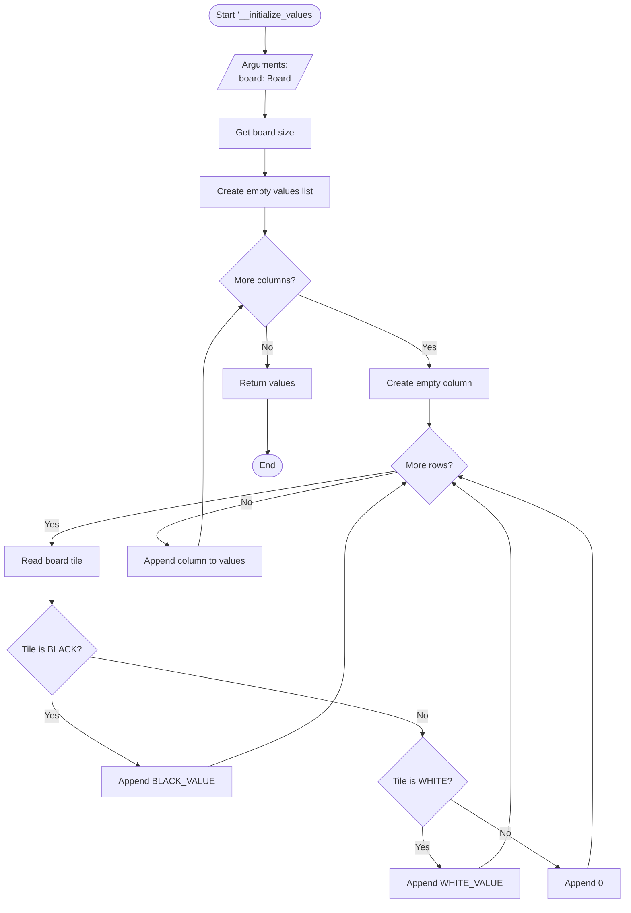
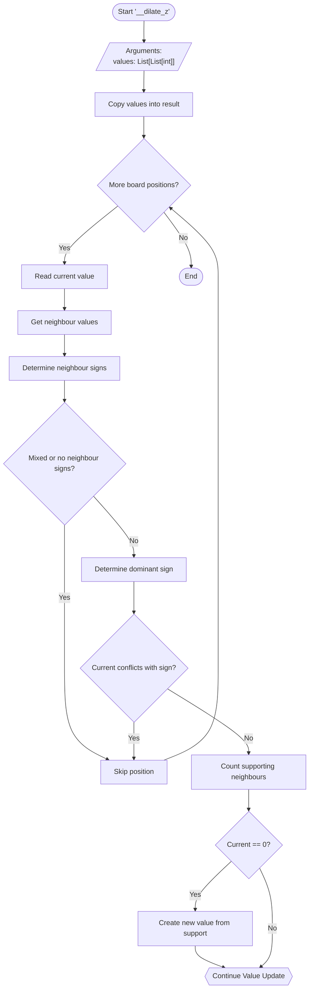
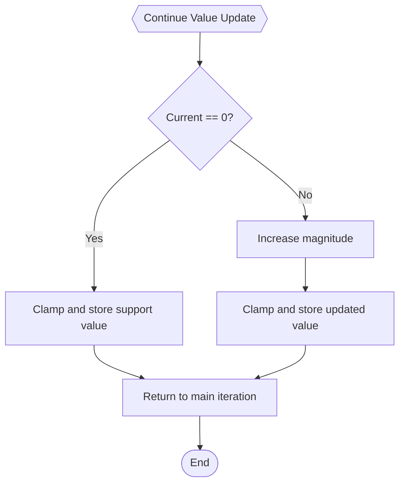
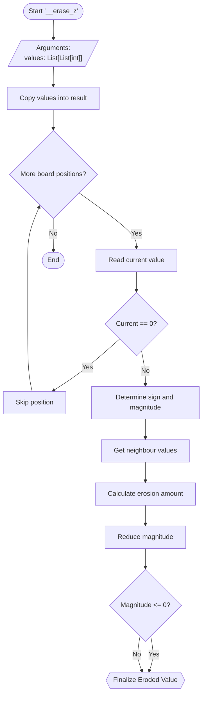
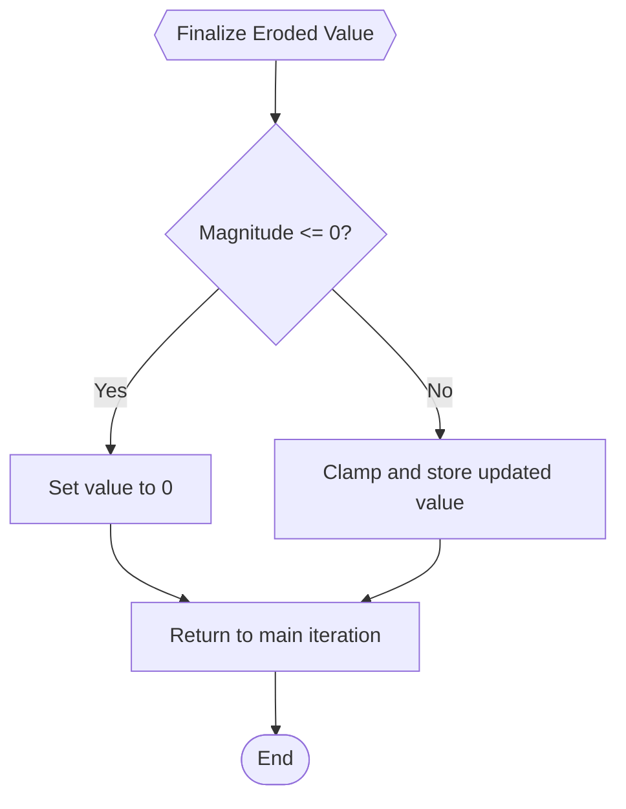
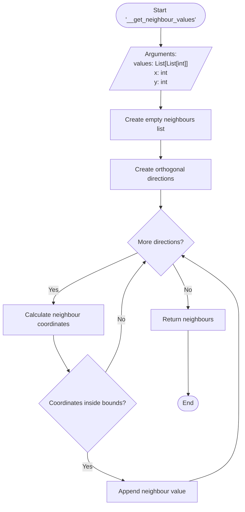
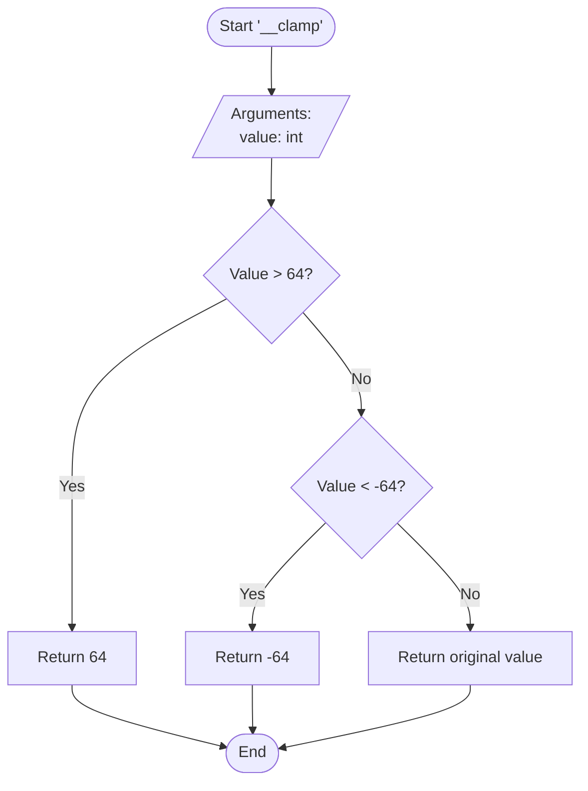

## `evaluate_values`

---

## `evaluate_territory_board`

---

## `print_values`

---

## `__initialize_values`

---

## `__dilate_z` — Part 1

---

## `__dilate_z` — Part 2

---

## `__erase_z` — Part 1

---

## `__erase_z` — Part 2

## `__get_neighbour_values`

---

## `__clamp`

