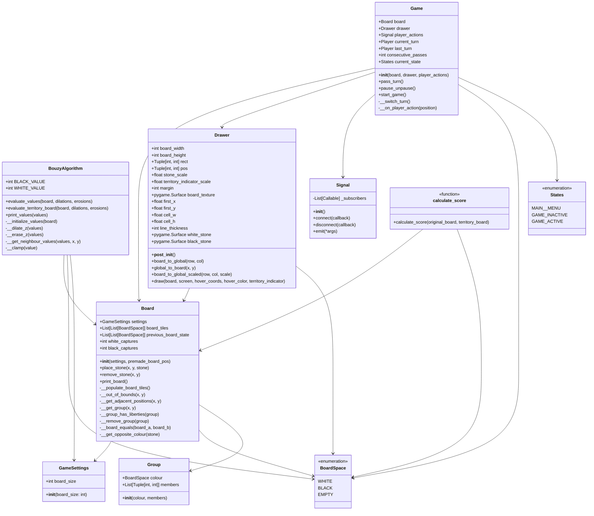

```mermaid
classDiagram
    class GameSettings {
        +int board_size
        +__init__(board_size: int)
    }
    class BoardSpace {
        <<enumeration>>
        WHITE
        BLACK
        EMPTY
    }
    class Group {
        +BoardSpace colour
        +List[Tuple[int, int]] members
        +__init__(colour, members)
    }
    class Board {
        +GameSettings settings
        +List[List[BoardSpace]] board_tiles
        +List[List[BoardSpace]] previous_board_state
        +int white_captures
        +int black_captures
        +__init__(settings, premade_board_pos)
        +place_stone(x, y, stone)
        +remove_stone(x, y)
        +print_board()
        -__populate_board_tiles()
        -__out_of_bounds(x, y)
        -__get_adjacent_positions(x, y)
        -__get_group(x, y)
        -__group_has_liberties(group)
        -__remove_group(group)
        -__board_equals(board_a, board_b)
        -__get_opposite_colour(stone)
    }
    Board --> GameSettings
    Board --> BoardSpace
    Board --> Group
    class BouzyAlgorithm {
        +int BLACK_VALUE
        +int WHITE_VALUE
        +evaluate_values(board, dilations, erosions)
        +evaluate_territory_board(board, dilations, erosions)
        +print_values(values)
        -__initialize_values(board)
        -__dilate_z(values)
        -__erase_z(values)
        -__get_neighbour_values(values, x, y)
        -__clamp(value)
    }
    BouzyAlgorithm --> Board
    BouzyAlgorithm --> BoardSpace
    BouzyAlgorithm --> GameSettings
    class Signal {
        -List[Callable] _subscribers
        +__init__()
        +connect(callback)
        +disconnect(callback)
        +emit(*args)
    }
    class Drawer {
        +int board_width
        +int board_height
        +Tuple[int, int] rect
        +Tuple[int, int] pos
        +float stone_scale
        +float territory_indicator_scale
        +int margin
        +pygame.Surface board_texture
        +float first_x
        +float first_y
        +float cell_w
        +float cell_h
        +int line_thickness
        +pygame.Surface white_stone
        +pygame.Surface black_stone
        +__post_init__()
        +board_to_global(row, col)
        +global_to_board(x, y)
        +board_to_global_scaled(row, col, scale)
        +draw(board, screen, hover_coords, hover_color, territory_indicator)
    }
    Drawer --> Board
    Drawer --> BoardSpace
    class States {
        <<enumeration>>
        MAIN__MENU
        GAME_INACTIVE
        GAME_ACTIVE
    }
    class Game {
        +Board board
        +Drawer drawer
        +Signal player_actions
        +Player current_turn
        +Player last_turn
        +int consecutive_passes
        +States current_state
        +__init__(board, drawer, player_actions)
        +pass_turn()
        +pause_unpause()
        +start_game()
        -__switch_turn()
        -__on_player_action(position)
    }
    Game --> Board
    Game --> Drawer
    Game --> Signal
    Game --> BoardSpace
    Game --> States
    class calculate_score {
        <<function>>
        +calculate_score(original_board, territory_board)
    }
    calculate_score --> Board
    calculate_score --> BoardSpace
```
