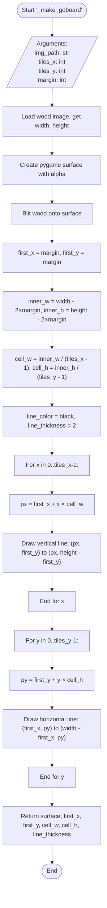
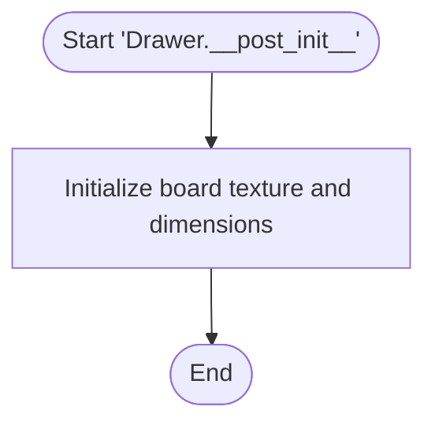
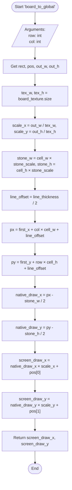
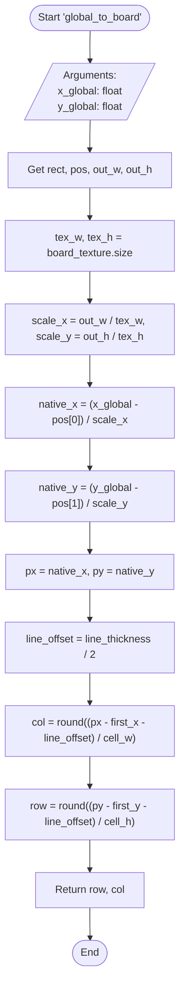
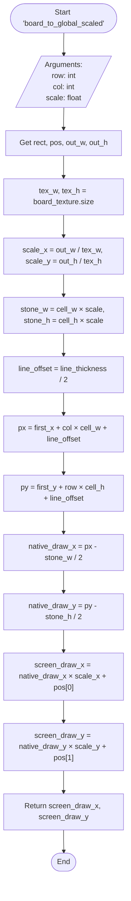

# Drawer.py Flowcharts

## `_make_goboard`

```mermaid
flowchart TD

    A(["Start '_make_goboard'"])

    A2[/"Arguments:
    img_path: str
    tiles_x: int
    tiles_y: int
    margin: int"
    /]

    B["Load wood image, get width, height"]

    C["Create pygame surface with alpha"]

    D["Blit wood onto surface"]

    E["first_x = margin, first_y = margin"]

    F["inner_w = width - 2×margin, inner_h = height - 2×margin"]

    G["cell_w = inner_w / (tiles_x - 1), cell_h = inner_h / (tiles_y - 1)"]

    H["line_color = black, line_thickness = 2"]

    I["For x in 0..tiles_x-1:"]

    J["px = first_x + x × cell_w"]

    K["Draw vertical line: (px, first_y) to (px, height - first_y)"]

    L["End for x"]

    M["For y in 0..tiles_y-1:"]

    N["py = first_y + y × cell_h"]

    O["Draw horizontal line: (first_x, py) to (width - first_x, py)"]

    P["End for y"]

    Q["Return surface, first_x, first_y, cell_w, cell_h, line_thickness"]

    R(["End"])

    A --> A2
    A2 --> B
    B --> C
    C --> D
    D --> E
    E --> F
    F --> G
    G --> H
    H --> I
    I --> J
    J --> K
    K --> L
    L --> M
    M --> N
    N --> O
    O --> P
    P --> Q
    Q --> R
```

## `Drawer.__post_init__`

```mermaid
flowchart TD

    A(["Start 'Drawer.__post_init__'"])

    B["Initialize board texture and dimensions"]

    C(["End"])

    A --> B
    B --> C
```

## `board_to_global`

```mermaid
flowchart TD

    A(["Start 'board_to_global'"])

    A2[/"Arguments:
    row: int
    col: int"
    /]

    B["Get rect, pos, out_w, out_h"]

    C["tex_w, tex_h = board_texture.size"]

    D["scale_x = out_w / tex_w, scale_y = out_h / tex_h"]

    E["stone_w = cell_w × stone_scale, stone_h = cell_h × stone_scale"]

    F["line_offset = line_thickness / 2"]

    G["px = first_x + col × cell_w + line_offset"]

    H["py = first_y + row × cell_h + line_offset"]

    I["native_draw_x = px - stone_w / 2"]

    J["native_draw_y = py - stone_h / 2"]

    K["screen_draw_x = native_draw_x × scale_x + pos[0]"]

    L["screen_draw_y = native_draw_y × scale_y + pos[1]"]

    M["Return screen_draw_x, screen_draw_y"]

    N(["End"])

    A --> A2
    A2 --> B
    B --> C
    C --> D
    D --> E
    E --> F
    F --> G
    G --> H
    H --> I
    I --> J
    J --> K
    K --> L
    L --> M
    M --> N
```

## `global_to_board`

```mermaid
flowchart TD

    A(["Start 'global_to_board'"])

    A2[/"Arguments:
    x_global: float
    y_global: float"
    /]

    B["Get rect, pos, out_w, out_h"]

    C["tex_w, tex_h = board_texture.size"]

    D["scale_x = out_w / tex_w, scale_y = out_h / tex_h"]

    E["native_x = (x_global - pos[0]) / scale_x"]

    F["native_y = (y_global - pos[1]) / scale_y"]

    G["px = native_x, py = native_y"]

    H["line_offset = line_thickness / 2"]

    I["col = round((px - first_x - line_offset) / cell_w)"]

    J["row = round((py - first_y - line_offset) / cell_h)"]

    K["Return row, col"]

    L(["End"])

    A --> A2
    A2 --> B
    B --> C
    C --> D
    D --> E
    E --> F
    F --> G
    G --> H
    H --> I
    I --> J
    J --> K
    K --> L
```

## `board_to_global_scaled`

```mermaid
flowchart TD

    A(["Start 'board_to_global_scaled'"])

    A2[/"Arguments:
    row: int
    col: int
    scale: float"
    /]

    B["Get rect, pos, out_w, out_h"]

    C["tex_w, tex_h = board_texture.size"]

    D["scale_x = out_w / tex_w, scale_y = out_h / tex_h"]

    E["stone_w = cell_w × scale, stone_h = cell_h × scale"]

    F["line_offset = line_thickness / 2"]

    G["px = first_x + col × cell_w + line_offset"]

    H["py = first_y + row × cell_h + line_offset"]

    I["native_draw_x = px - stone_w / 2"]

    J["native_draw_y = py - stone_h / 2"]

    K["screen_draw_x = native_draw_x × scale_x + pos[0]"]

    L["screen_draw_y = native_draw_y × scale_y + pos[1]"]

    M["Return screen_draw_x, screen_draw_y"]

    N(["End"])

    A --> A2
    A2 --> B
    B --> C
    C --> D
    D --> E
    E --> F
    F --> G
    G --> H
    H --> I
    I --> J
    J --> K
    K --> L
    L --> M
    M --> N
```

## `draw`

```mermaid
flowchart TD

    A(["Start 'draw'"])

    A2[/"Arguments:
    board: Board
    screen: pygame.Surface
    hover_coords: Tuple[int,int]
    hover_color: BoardSpace
    territory_indicator: Optional[Board] = None"
    /]

    B["Get rect, pos, out_w, out_h"]

    C["board_state = board.board_tiles"]

    D["territory_state = territory_indicator?.board_tiles"]

    E["Scale board_texture to (out_w, out_h)"]

    F["Blit scaled_board at pos"]

    G["tex_w, tex_h = board_texture.size"]

    H["scale_x = out_w / tex_w, scale_y = out_h / tex_h"]

    I["stone_w_native = cell_w × stone_scale, stone_h_native = cell_h × stone_scale"]

    J["stone_w_screen = stone_w_native × scale_x, stone_h_screen = stone_h_native × scale_y"]

    K["Scale black/white stones to screen sizes"]

    L["For row in 0..board_height-1:"]

    M["For col in 0..board_width-1:"]

    N["space = board_state[row][col]"]

    O{"space == EMPTY?"}

    P["Continue"]

    Q["screen_draw_x, screen_draw_y = board_to_global(row, col)"]

    R{"space == BLACK?"}

    S["Blit black stone"]

    T["Blit white stone"]

    U["End for col"]

    V["End for row"]

    W{"territory_state != None?"}

    X["Scale territory stones"]

    Y["Draw territory stones"]

    Z["End territory loop"]

    AA{"hover_color != EMPTY?"}

    BB["hover_row, hover_col = hover_coords"]

    CC["board_x, board_y = global_to_board(hover_row, hover_col)"]

    DD{"In bounds and board[board_x][board_y] == EMPTY?"}

    EE["screen_draw_x, screen_draw_y = board_to_global(board_x, board_y)"]

    FF{"hover_color == BLACK?"}

    GG["hover_stone = black stone copy"]

    HH["hover_stone = white stone copy"]

    II["Set alpha to 200"]

    JJ["Blit hover_stone"]

    KK(["End"])

    A --> A2
    A2 --> B
    B --> C
    C --> D
    D --> E
    E --> F
    F --> G
    G --> H
    H --> I
    I --> J
    J --> K
    K --> L
    L --> M
    M --> N
    N --> O

    O -->|Yes| P
    O -->|No| Q
    Q --> R

    R -->|Yes| S
    R -->|No| T

    S --> U
    T --> U
    P --> U

    U --> V
    V --> W

    W -->|Yes| X
    W -->|No| AA

    X --> Y
    Y --> Z
    Z --> AA

    AA -->|Yes| BB
    AA -->|No| KK

    BB --> CC
    CC --> DD

    DD -->|Yes| EE
    DD -->|No| KK

    EE --> FF

    FF -->|Yes| GG
    FF -->|No| HH

    GG --> II
    HH --> II
    II --> JJ
    JJ --> KK
```
