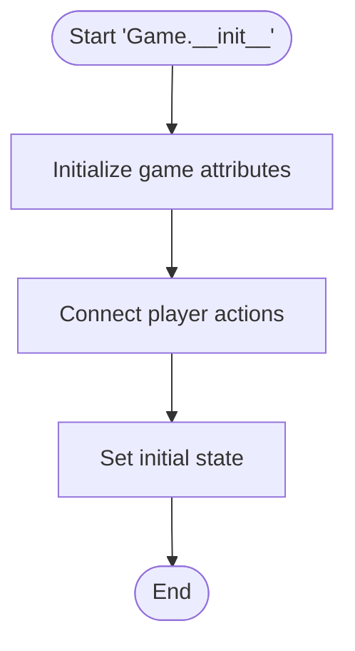
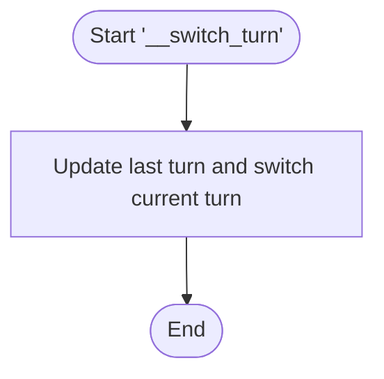
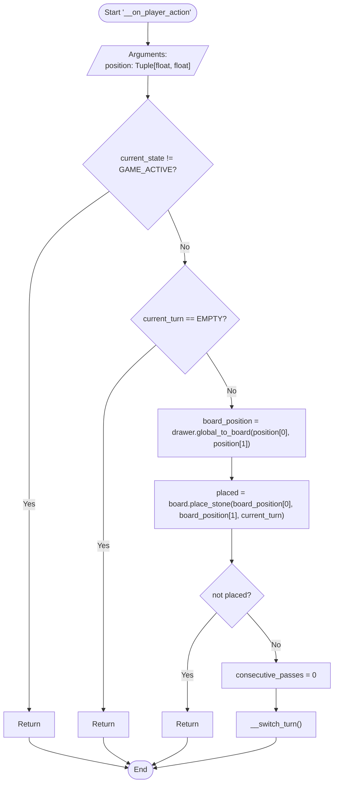
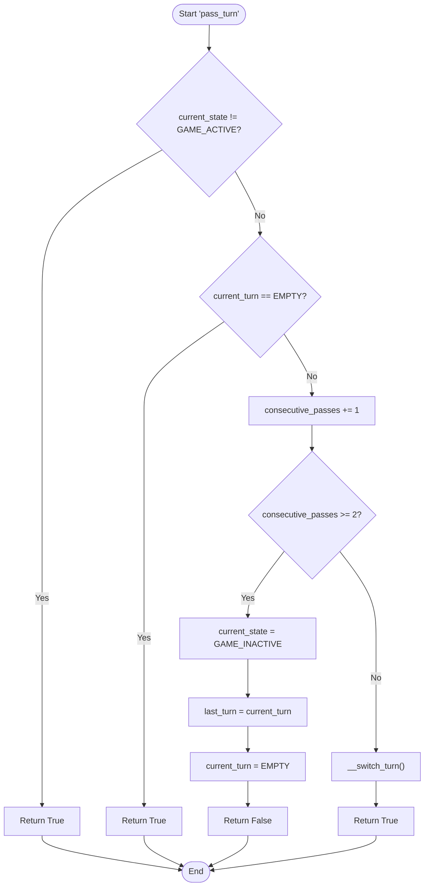
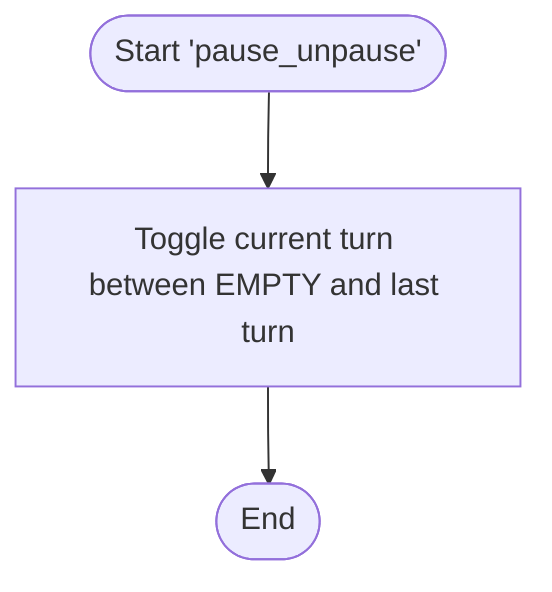
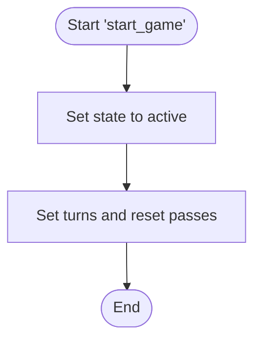

# Game.py Flowcharts

## `Game.__init__`

```mermaid
flowchart TD

    A(["Start 'Game.__init__'"])

    B["Initialize game attributes"]

    C["Connect player actions"]

    D["Set initial state"]

    E(["End"])

    A --> B
    B --> C
    C --> D
    D --> E
```

## `__switch_turn`

```mermaid
flowchart TD

    A(["Start '__switch_turn'"])

    B["Update last turn and switch current turn"]

    C(["End"])

    A --> B
    B --> C
```

## `__on_player_action`

```mermaid
flowchart TD

    A(["Start '__on_player_action'"])

    A2[/"Arguments:
    position: Tuple[float, float]"
    /]

    B{"current_state != GAME_ACTIVE?"}

    C["Return"]

    D{"current_turn == EMPTY?"}

    E["Return"]

    F["board_position = drawer.global_to_board(position[0], position[1])"]

    G["placed = board.place_stone(board_position[0], board_position[1], current_turn)"]

    H{"not placed?"}

    I["Return"]

    J["consecutive_passes = 0"]

    K["__switch_turn()"]

    L(["End"])

    A --> A2
    A2 --> B

    B -->|Yes| C
    B -->|No| D

    D -->|Yes| E
    D -->|No| F
    F --> G
    G --> H

    H -->|Yes| I
    H -->|No| J
    J --> K
    K --> L

    C --> L
    E --> L
    I --> L
```

## `pass_turn`

```mermaid
flowchart TD

    A(["Start 'pass_turn'"])

    B{"current_state != GAME_ACTIVE?"}

    C["Return True"]

    D{"current_turn == EMPTY?"}

    E["Return True"]

    F["consecutive_passes += 1"]

    G{"consecutive_passes >= 2?"}

    H["current_state = GAME_INACTIVE"]

    I["last_turn = current_turn"]

    J["current_turn = EMPTY"]

    K["Return False"]

    L["__switch_turn()"]

    M["Return True"]

    N(["End"])

    A --> B

    B -->|Yes| C
    B -->|No| D

    D -->|Yes| E
    D -->|No| F
    F --> G

    G -->|Yes| H
    G -->|No| L

    H --> I
    I --> J
    J --> K

    L --> M

    C --> N
    E --> N
    K --> N
    M --> N
```

## `pause_unpause`

```mermaid
flowchart TD

    A(["Start 'pause_unpause'"])

    B["Toggle current turn between EMPTY and last turn"]

    C(["End"])

    A --> B
    B --> C
```

## `start_game`

```mermaid
flowchart TD

    A(["Start 'start_game'"])

    B["Set state to active"]

    C["Set turns and reset passes"]

    D(["End"])

    A --> B
    B --> C
    C --> D
```
