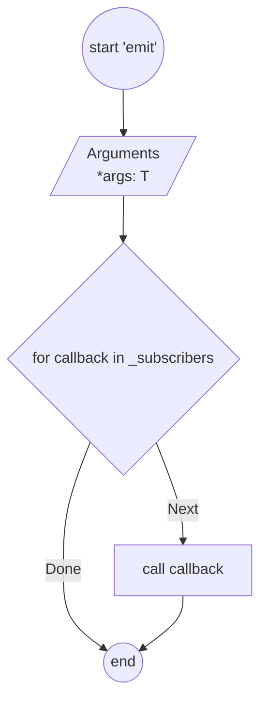

# Signal.py flowcharts

## emit

```mermaid
flowchart TD
a(("start 'emit'"))-->b

b[/"Arguments
*args: T
"/]-->c

c{"for callback in _subscribers"}
c-->|"Next"|d
c-->|"Done"|e

d[call callback]

d-->e(("end"))
```
